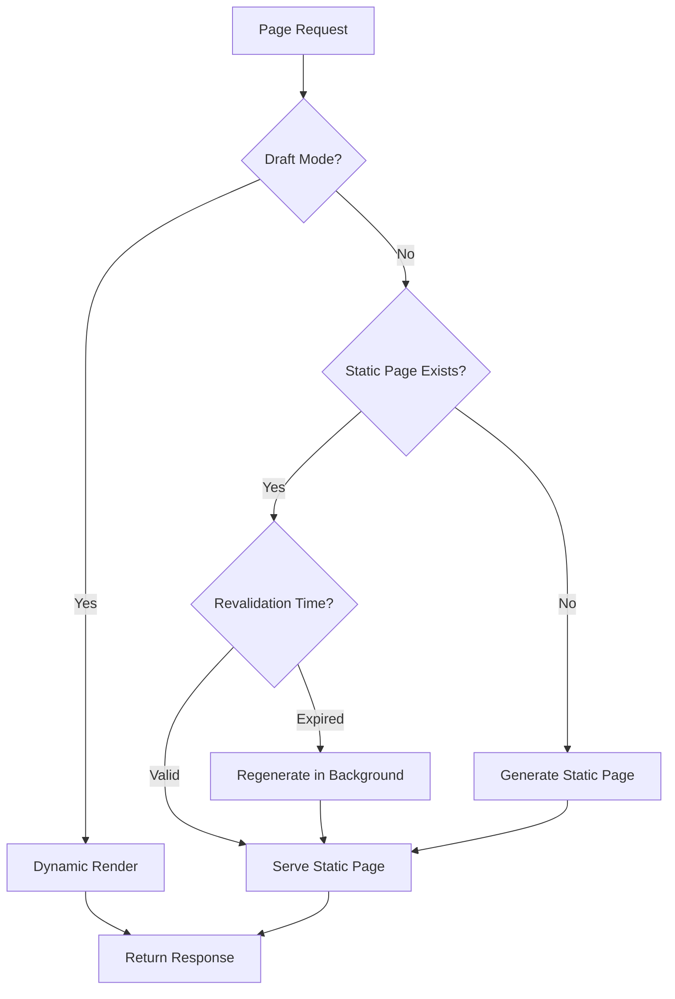

# Performance Optimization Design Document

## Overview

This design document outlines the technical approach for optimizing the Next.js 15 + Storyblok application. The optimization strategy focuses on six key areas: bundle optimization, rendering strategies, asset optimization, caching mechanisms, code splitting, and monitoring. The design maintains backward compatibility with existing Storyblok CMS integration while significantly improving performance metrics.

### Performance Goals

- Reduce initial JavaScript bundle by 30%+
- Reduce CSS bundle by 25%+
- Achieve LCP < 2.5s on 3G connections
- Achieve FID < 100ms
- Achieve CLS < 0.1
- Reduce build time by 20%+
- Implement 95%+ cache hit rate for published content

## Architecture

### High-Level Architecture

```
┌─────────────────────────────────────────────────────────────┐
│                        Client Browser                        │
├─────────────────────────────────────────────────────────────┤
│  Optimized Bundles  │  Lazy Components  │  Cached Assets    │
└──────────────┬──────────────────────────────────────────────┘
               │
               ▼
┌─────────────────────────────────────────────────────────────┐
│                      Next.js Edge/Server                     │
├─────────────────────────────────────────────────────────────┤
│  ISR Pages  │  Cache Layer  │  Component Registry          │
└──────────────┬──────────────────────────────────────────────┘
               │
               ▼
┌─────────────────────────────────────────────────────────────┐
│                    Storyblok CMS API                         │
├─────────────────────────────────────────────────────────────┤
│  Content  │  Assets  │  Webhooks                            │
└─────────────────────────────────────────────────────────────┘
```

### Rendering Strategy Flow



## Components and Interfaces

### 1. Dynamic Component Registry

**Purpose:** Replace static component registration with dynamic imports to reduce initial bundle size

**Implementation:**

```typescript
// src/lib/component-registry.ts
import { lazy } from 'react';
import type { ComponentType } from 'react';

// Component map with dynamic imports
export const componentRegistry: Record<string, () => Promise<{ default: ComponentType<any> }>> = {
  page: () => import('@/components/blok/services/Page'),
  header: () => import('@/components/blok/services/Header'),
  footer: () => import('@/components/blok/services/Footer'),
  blogs: () => import('@/components/blok/services/Blogs'),
  // ... other components
};

// Lazy component loader with error boundary
export function loadComponent(componentName: string) {
  const loader = componentRegistry[componentName];
  if (!loader) {
    console.warn(`Component ${componentName} not found in registry`);
    return null;
  }
  return lazy(loader);
}
```

**Changes Required:**
- Remove all component imports from `src/app/[locale]/layout.tsx`
- Update `StoryblokProvider` to use dynamic registry
- Implement loading states for lazy components

### 2. Optimized Storyblok Provider

**Purpose:** Reduce client-side bundle by conditionally loading bridge and optimizing component resolution

**Implementation:**

```typescript
// src/components/StoryblokProvider.tsx (optimized)
'use client';

import { Suspense, lazy } from 'react';
import { loadComponent } from '@/lib/component-registry';

// Only load bridge in preview mode
const StoryblokBridge = lazy(() => 
  import('@/lib/storyblok-bridge').then(mod => ({ default: mod.StoryblokBridge }))
);

export default function StoryblokProvider({ children, isPreview }) {
  return (
    <>
      {children}
      {isPreview && (
        <Suspense fallback={null}>
          <StoryblokBridge />
        </Suspense>
      )}
    </>
  );
}
```

### 3. Cache Layer

**Purpose:** Implement multi-tier caching for Storyblok API responses

**Architecture:**

```
┌─────────────────────────────────────────────────────────┐
│                    Cache Hierarchy                       │
├─────────────────────────────────────────────────────────┤
│  L1: Memory Cache (Node.js Map) - 5 min TTL            │
│  L2: Next.js Cache (unstable_cache) - 1 hour TTL       │
│  L3: CDN Cache (Cache-Control headers) - 24 hour TTL   │
└─────────────────────────────────────────────────────────┘
```

**Implementation:**

```typescript
// src/lib/storyblok-cache.ts
import { unstable_cache } from 'next/cache';

interface CacheConfig {
  ttl: number;
  tags: string[];
  revalidate?: number;
}

// Memory cache for hot data
const memoryCache = new Map<string, { data: any; expires: number }>();

export async function getCachedStory(
  slug: string,
  locale: string,
  version: 'draft' | 'published'
) {
  const cacheKey = `story:${slug}:${locale}:${version}`;
  
  // L1: Check memory cache
  const cached = memoryCache.get(cacheKey);
  if (cached && cached.expires > Date.now()) {
    return cached.data;
  }
  
  // L2: Use Next.js cache with tags for invalidation
  const fetchStory = unstable_cache(
    async () => {
      const storyblokApi = getStoryblokApi();
      const { data } = await storyblokApi.get(`cdn/stories/${slug}`, {
        version,
        language: locale,
        fallback_lang: 'en',
      });
      return data;
    },
    [cacheKey],
    {
      revalidate: version === 'published' ? 3600 : false, // 1 hour for published
      tags: [`story:${slug}`, `locale:${locale}`],
    }
  );
  
  const data = await fetchStory();
  
  // Update memory cache
  memoryCache.set(cacheKey, {
    data,
    expires: Date.now() + (version === 'published' ? 300000 : 60000), // 5 min / 1 min
  });
  
  return data;
}

// Cache invalidation
export function invalidateStory(slug: string) {
  revalidateTag(`story:${slug}`);
  // Clear memory cache
  for (const key of memoryCache.keys()) {
    if (key.includes(slug)) {
      memoryCache.delete(key);
    }
  }
}
```

### 4. Font Optimization System

**Purpose:** Reduce font loading time and eliminate render-blocking fonts

**Strategy:**

1. **Font Subsetting:** Create subsets for each language
2. **Format Optimization:** Use only WOFF2 (95%+ browser support)
3. **Preloading:** Preload critical fonts
4. **Font Display:** Use `swap` for all fonts

**Implementation:**

```typescript
// src/app/[locale]/layout.tsx
import { BelfiusMontserrat } from '@/lib/fonts';

// Optimized font loading
const belfiusMontserrat = BelfiusMontserrat({
  subsets: ['latin'],
  display: 'swap',
  preload: true,
  variable: '--font-belfius',
  weight: ['300', '400', '500', '600', '700'],
});
```

**Font File Structure:**
```
public/fonts/
├── belfius-montserrat-latin-300.woff2
├── belfius-montserrat-latin-400.woff2
├── belfius-montserrat-latin-500.woff2
├── belfius-montserrat-latin-600.woff2
└── belfius-montserrat-latin-700.woff2
```

### 5. Image Optimization Pipeline

**Purpose:** Optimize image delivery with proper sizing, formats, and loading strategies

**Implementation:**

```typescript
// src/components/ui/OptimizedImage.tsx
import Image from 'next/image';
import { getImageDimensions, getOptimizedUrl } from '@/lib/image-utils';

interface OptimizedImageProps {
  src: string;
  alt: string;
  priority?: boolean;
  sizes?: string;
  className?: string;
}

export function OptimizedImage({ 
  src, 
  alt, 
  priority = false,
  sizes = '100vw',
  className 
}: OptimizedImageProps) {
  // Extract dimensions from Storyblok URL or use defaults
  const { width, height } = getImageDimensions(src);
  
  // Generate optimized Storyblok image service URL
  const optimizedSrc = getOptimizedUrl(src, {
    format: 'webp',
    quality: 80,
    width: width,
  });
  
  return (
    <Image
      src={optimizedSrc}
      alt={alt}
      width={width}
      height={height}
      sizes={sizes}
      priority={priority}
      loading={priority ? 'eager' : 'lazy'}
      className={className}
      placeholder="blur"
      blurDataURL={getOptimizedUrl(src, { width: 10, quality: 10 })}
    />
  );
}
```

**Storyblok Image Service Parameters:**
```
https://a.storyblok.com/f/{space_id}/{path}/m/
  ?format=webp
  &quality=80
  &width={width}
  &fit=in
```

### 6. Rendering Strategy Implementation

**Purpose:** Implement appropriate rendering strategies for different page types

**Page Configuration:**

```typescript
// src/app/[locale]/[...slug]/page.tsx
export const dynamic = 'force-static'; // Changed from force-dynamic
export const revalidate = 3600; // Revalidate every hour

// Generate static params for known routes
export async function generateStaticParams() {
  const storyblokApi = getStoryblokApi();
  const { data } = await storyblokApi.get('cdn/links', {
    version: 'published',
  });
  
  const paths = Object.values(data.links)
    .filter((link: any) => !link.is_folder)
    .map((link: any) => ({
      slug: link.slug === 'home' ? [] : link.slug.split('/'),
      locale: link.lang || 'en',
    }));
  
  return paths;
}
```

**On-Demand Revalidation:**

```typescript
// src/app/api/revalidate/route.ts
import { revalidatePath, revalidateTag } from 'next/cache';
import { NextRequest, NextResponse } from 'next/server';

export async function POST(request: NextRequest) {
  const secret = request.nextUrl.searchParams.get('secret');
  
  // Validate webhook secret
  if (secret !== process.env.REVALIDATION_SECRET) {
    return NextResponse.json({ message: 'Invalid secret' }, { status: 401 });
  }
  
  const body = await request.json();
  const { story_id, slug, action } = body;
  
  // Revalidate specific story
  if (slug) {
    revalidateTag(`story:${slug}`);
    revalidatePath(`/${slug}`);
  }
  
  return NextResponse.json({ revalidated: true, now: Date.now() });
}
```

### 7. CSS Optimization

**Purpose:** Reduce CSS bundle size and eliminate unused styles

**Tailwind Configuration Updates:**

```typescript
// tailwind.config.ts
export default {
  content: [
    './src/**/*.{js,ts,jsx,tsx,mdx}',
  ],
  // Reduce safelist to only truly dynamic classes
  safelist: [
    // Only CMS-driven dynamic classes
    { pattern: /^bg-(red|grey)-(light|dark|gradient)$/ },
    { pattern: /^text-(red|grey)-(light|dark)$/ },
    { pattern: /^grid-cols-(1|2|3|4|5|6)$/ },
    { pattern: /^md:grid-cols-(1|2|3|4|5|6)$/ },
    { pattern: /^lg:grid-cols-(1|2|3|4|5|6)$/ },
  ],
  // Enable JIT mode optimizations
  mode: 'jit',
};
```

**Critical CSS Extraction:**

```typescript
// next.config.ts
const nextConfig = {
  experimental: {
    optimizeCss: true, // Enable CSS optimization
  },
};
```

### 8. Bundle Analysis and Monitoring

**Purpose:** Track bundle sizes and performance metrics

**Webpack Bundle Analyzer Integration:**

```typescript
// next.config.ts
import bundleAnalyzer from '@next/bundle-analyzer';

const withBundleAnalyzer = bundleAnalyzer({
  enabled: process.env.ANALYZE === 'true',
});

export default withBundleAnalyzer(nextConfig);
```

**Performance Budgets:**

```json
// .performance-budgets.json
{
  "budgets": [
    {
      "path": "/_app",
      "maxSize": "150kb",
      "type": "initial"
    },
    {
      "path": "/[locale]/[...slug]",
      "maxSize": "200kb",
      "type": "initial"
    }
  ]
}
```

## Data Models

### Cache Entry Model

```typescript
interface CacheEntry<T> {
  key: string;
  data: T;
  expires: number;
  tags: string[];
  version: 'draft' | 'published';
}

interface StoryCache {
  story: ISbStoryData;
  metadata: {
    cachedAt: number;
    locale: string;
    version: string;
  };
}
```

### Performance Metrics Model

```typescript
interface PerformanceMetrics {
  route: string;
  metrics: {
    lcp: number;
    fid: number;
    cls: number;
    ttfb: number;
    fcp: number;
  };
  timestamp: number;
  userAgent: string;
}

interface BundleMetrics {
  route: string;
  sizes: {
    javascript: number;
    css: number;
    total: number;
  };
  chunks: Array<{
    name: string;
    size: number;
  }>;
}
```

## Error Handling

### Cache Fallback Strategy

```typescript
async function getCachedStoryWithFallback(slug: string, locale: string) {
  try {
    // Try cache first
    return await getCachedStory(slug, locale, 'published');
  } catch (error) {
    console.error('Cache error:', error);
    
    // Fallback to direct API call
    try {
      const storyblokApi = getStoryblokApi();
      const { data } = await storyblokApi.get(`cdn/stories/${slug}`, {
        version: 'published',
        language: locale,
      });
      return data;
    } catch (apiError) {
      console.error('API error:', apiError);
      throw new Error('Failed to fetch story');
    }
  }
}
```

### Component Loading Errors

```typescript
// src/components/ErrorBoundary.tsx
'use client';

import { Component, ReactNode } from 'react';

export class ComponentErrorBoundary extends Component<
  { children: ReactNode; fallback?: ReactNode },
  { hasError: boolean }
> {
  constructor(props) {
    super(props);
    this.state = { hasError: false };
  }

  static getDerivedStateFromError() {
    return { hasError: true };
  }

  componentDidCatch(error, errorInfo) {
    console.error('Component error:', error, errorInfo);
  }

  render() {
    if (this.state.hasError) {
      return this.props.fallback || <div>Component failed to load</div>;
    }

    return this.props.children;
  }
}
```

## Testing Strategy

### Performance Testing

1. **Lighthouse CI Integration**
   - Run Lighthouse audits on every PR
   - Fail builds if performance score drops below 90
   - Track metrics over time

2. **Bundle Size Testing**
   - Compare bundle sizes against baseline
   - Alert on increases > 5%
   - Generate size reports in CI

3. **Load Testing**
   - Test cache hit rates under load
   - Verify ISR regeneration behavior
   - Test concurrent request handling

### Test Scenarios

```typescript
// __tests__/performance/cache.test.ts
describe('Storyblok Cache', () => {
  it('should return cached data on second request', async () => {
    const slug = 'test-page';
    const locale = 'en';
    
    // First request - cache miss
    const start1 = Date.now();
    await getCachedStory(slug, locale, 'published');
    const duration1 = Date.now() - start1;
    
    // Second request - cache hit
    const start2 = Date.now();
    await getCachedStory(slug, locale, 'published');
    const duration2 = Date.now() - start2;
    
    // Cache hit should be significantly faster
    expect(duration2).toBeLessThan(duration1 * 0.1);
  });
  
  it('should invalidate cache on webhook', async () => {
    const slug = 'test-page';
    
    // Cache story
    await getCachedStory(slug, 'en', 'published');
    
    // Invalidate
    await invalidateStory(slug);
    
    // Verify cache is cleared
    const cached = memoryCache.get(`story:${slug}:en:published`);
    expect(cached).toBeUndefined();
  });
});
```

### Integration Testing

```typescript
// __tests__/integration/rendering.test.ts
describe('Page Rendering', () => {
  it('should serve static pages for published content', async () => {
    const response = await fetch('http://localhost:3000/en/test-page');
    const headers = response.headers;
    
    // Verify static generation
    expect(headers.get('x-nextjs-cache')).toBe('HIT');
  });
  
  it('should use dynamic rendering in draft mode', async () => {
    const response = await fetch('http://localhost:3000/en/test-page?_storyblok=123');
    const headers = response.headers;
    
    // Verify dynamic rendering
    expect(headers.get('x-nextjs-cache')).toBeNull();
  });
});
```

## Implementation Phases

### Phase 1: Foundation (Week 1)
- Set up bundle analyzer
- Implement performance monitoring
- Create baseline metrics
- Set up CI/CD performance checks

### Phase 2: Bundle Optimization (Week 2)
- Implement dynamic component registry
- Remove duplicate imports
- Add code splitting
- Optimize third-party scripts

### Phase 3: Rendering Strategy (Week 2-3)
- Implement ISR for pages
- Add static generation
- Create revalidation API
- Set up Storyblok webhooks

### Phase 4: Asset Optimization (Week 3)
- Optimize font loading
- Implement image optimization
- Reduce CSS bundle
- Add critical CSS

### Phase 5: Caching Layer (Week 4)
- Implement cache system
- Add cache invalidation
- Set up CDN caching
- Optimize cache strategies

### Phase 6: Testing & Monitoring (Week 4-5)
- Add performance tests
- Set up Lighthouse CI
- Create monitoring dashboard
- Document optimizations

## Performance Targets

### Before Optimization (Baseline)
- Initial JS Bundle: ~800KB
- CSS Bundle: ~150KB
- LCP: 4.5s (3G)
- FID: 250ms
- CLS: 0.25
- Build Time: 180s

### After Optimization (Target)
- Initial JS Bundle: <560KB (30% reduction)
- CSS Bundle: <112KB (25% reduction)
- LCP: <2.5s (3G)
- FID: <100ms
- CLS: <0.1
- Build Time: <144s (20% reduction)
- Cache Hit Rate: >95%

## Monitoring and Maintenance

### Metrics to Track

1. **Core Web Vitals**
   - LCP, FID, CLS per page
   - Track 75th percentile
   - Alert on regressions

2. **Bundle Sizes**
   - JavaScript per route
   - CSS per route
   - Total asset size

3. **Cache Performance**
   - Hit rate
   - Miss rate
   - Invalidation frequency

4. **Build Performance**
   - Build duration
   - Number of pages generated
   - Cache utilization

### Alerting Thresholds

- LCP > 3s: Warning
- LCP > 4s: Critical
- Bundle increase > 10%: Warning
- Bundle increase > 20%: Critical
- Cache hit rate < 90%: Warning
- Cache hit rate < 80%: Critical
